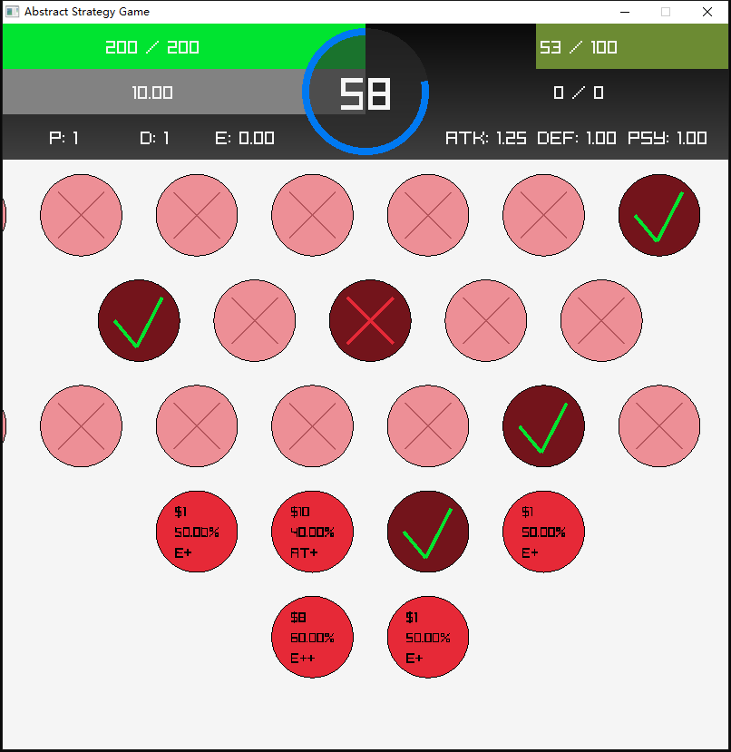

# Abstract Strategy Game

## Introduction

A learning project of [Raylib](https://github.com/raysan5/raylib), STL and [SLikeNet](https://github.com/SLikeSoft/SLikeNet). The structure of the codes were never planned or organized. You may find only spaghetti codes here.

This is my first attempt of writing games in plain C++, and my first attempt of writing networked games. The structure of this code was directly refactored from a Hello World Raylib project, and boy did it grew into something (ugly, mostly :P). I've been making small games in GameMaker as hobby projects before, and I must say this experience, programming with C++, STL, Raylib and SLikeNet is by far the most satisfying one. There are many helps I have gotten from many people and places, and there are many things I have learned from them.

## Build Details

The CMakeLists.txt I've written is pretty much useless on other machines. This Github page is only for archival purposes.

This project uses MinGW and CMake to build. MinGW with GCC 10.3 can be acquired from [WinLibs](https://winlibs.com/#download-release). The source code of Raylib can be acquired from [Github](https://github.com/raysan5/raylib), [Official Website](https://www.raylib.com/), [Itch.io](https://raysan5.itch.io/raylib) and many other sites. It's a easy to use, OpenGL-based game rendering engine.

SLikeNet's [official page is here](https://www.slikesoft.com/?page_id=1224&lang=en), and its [Github page is here](https://github.com/SLikeSoft/SLikeNet). However, the official version of SLikeNet doesn't really support MinGW well. I've looked up other's fixes and workarounds, and finally found Urho3D's modification of SLikeNet, which fully supports MinGW with a few fixes. The github page of [Urho3D is here](https://github.com/urho3d/Urho3D), and their version of [SLikeNet is here](https://github.com/urho3d/Urho3D/blob/master/Source/ThirdParty/SLikeNet).

## Basic Control

The objective is reduce the opponent's health to 0 or below 0. The bars on the left are player's **HP** bar and **Matter** (shield) bar. The bars on the right are opponents.

The big number in the center is the **Credit** the player is currently holding. Every **Decision** requires certain cost.

The text below the bars are player's attributes: **Perception (Knowledge), Deception, Energy, Attack, Defense, Psyche**.
- Perception increases the precision of the estimation of opponent's health and matter.
- Deception increases the difficulty for the opponent to estimate player's health and matter.
- Energy is player's currently holding energy.
- Attack is player's damage modifier.
- Defense is player's matter effectiveness.
- Psyche is player's HP toughness.

Every 100 Max HP is one **Level**. Attack increases per level.

<kbd>Q</kbd>, <kbd>W</kbd>, <kbd>E</kbd>, <kbd>R</kbd> switches the displaying tree.
- <kbd>Q</kbd> is the perception tree (white) where player can increase Perception and Deception, and reduce credit timer.
- <kbd>W</kbd> is the regeneration tree (green) where player can regenerate HP, level up and decrease Psyche.
- <kbd>E</kbd> is the destruction tree (red) where player can accumulate energy and increase Attack.
- <kbd>R</kbd> is the protection tree (blue) where player can refill matter, increase max matter and increase Defense.

The nodes in the trees are **Decisions**. The number on the top means how much this decision costs. The number in the middle means the probability of its success (Decision can FAIL). The text on the bottom means what this decision does. (P)erception, (D)eception, (C)redit (T)imer, (M)at(T)er, (E)nergy, (L)e(V)el, etc.

Use <kbd>Mouse Left Button</kbd> to select a decision. Use <kbd>Mouse Right Button</kbd> to pan the interface. Use <kbd>Mouse Wheel</kbd> to zoom in/out.

Use <kbd>Spacebar</kbd> to unleash your current holding energy upon your opponent. Your energy will be emptied after unleashing.

Use <kbd>F10</kbd> to restart game, in both single-player mode and multi-player mode.

Use <kbd>F8</kbd> to forcifully disconnect your game from remote system.

## TODO

- Potion Queue
- AI
- Better Deception and Estimation
- Complete GUI
- Refactor Trees
- Config Files
- Resource Check
- Main Menu
- Game Balance

## Screenshot

